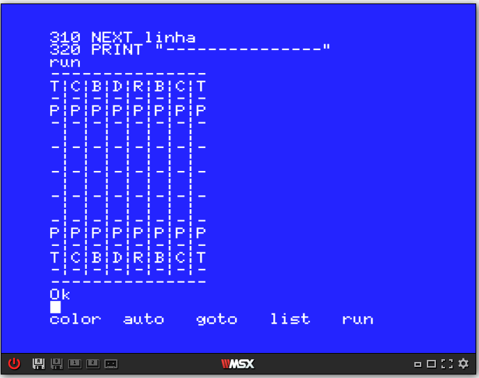

# Basic_Schaumann

- O pseudocódigo e o código em BASIC do programa de xadrez são os seguinte:

  [Pseudocódigo](https://github.com/ProgramacaoEE2020/Basic_Schaumann/blob/master/Codigos/Chess-Pseudocodigo.txt)

  [Código](https://github.com/ProgramacaoEE2020/Basic_Schaumann/blob/master/Codigos/chess_table_BASIC.txt) em BASIC

- Como resultado, obtém-se o seguinte screenshot:

